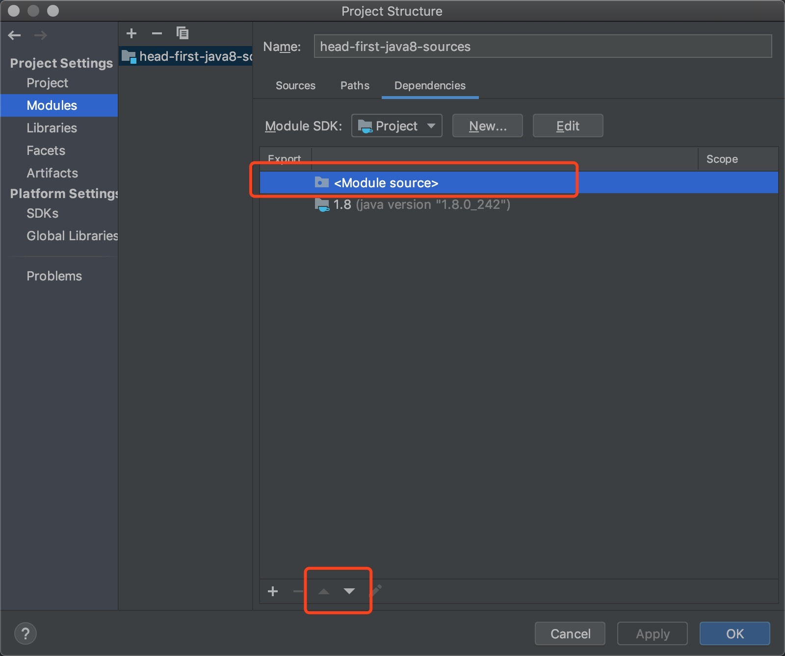

源码分析环境搭建

## 最简版
1. 安装 openjdk 1.8.242, 其他版本可能导致 debug 时代码行映射不对的问题. 
2. clone 本仓库, 用 idea 打开即可, 开箱即用. 

## 正常版
1. 安装某版本 JDK.
2. idea 新建一个 java 项目. 
3. JDK 安装目录下会有 src.zip , 解压到第二步创建的 java 项目的 src 目录下. 
4. 项目新建目录 tests,并指定 tests 为 test sources root. 
5. 调整项目依赖. 优先使用项目src内的源码. 

6. over