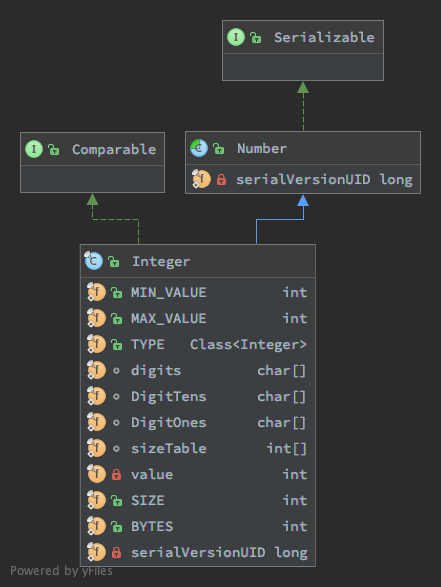

## 概览
Integer 是原始类型 int 的包装类, 提供了一些处理 int 类型的方法,和一些 Integer, String 互相转换的方法, 以及一些位运算. 

## 继承结构


## 常见用法
[测试类](../tests/lang/IntegerTest.java)
```java
int x = 1;
```

## 主要属性
### 成员变量
```java
private final int value; // 真实的 int 值
``` ### 静态变量
```java
public static final int MIN_VALUE = 0x80000000; // => 0b10000000000000000000000000000000 => -2147483648
public static final int MAX_VALUE = 0x7fffffff; // => 0b01111111111111111111111111111111 =>  2147483647
public static final int SIZE = 32; // 即 32 bit位
public static final int BYTES = SIZE / Byte.SIZE; // => 4 byte
public static final Class<Integer>  TYPE = (Class<Integer>) Class.getPrimitiveClass("int");
```

## 内部类
### IntegerCache
```java
private static class IntegerCache {
        static final int low = -128;
        static final int high;
        static final Integer cache[];

        static {
            // high value may be configured by property
            int h = 127;
            String integerCacheHighPropValue =
                sun.misc.VM.getSavedProperty("java.lang.Integer.IntegerCache.high");
            if (integerCacheHighPropValue != null) {
                try {
                    int i = parseInt(integerCacheHighPropValue);
                    i = Math.max(i, 127);
                    // Maximum array size is Integer.MAX_VALUE
                    h = Math.min(i, Integer.MAX_VALUE - (-low) -1);
                } catch( NumberFormatException nfe) {
                    // If the property cannot be parsed into an int, ignore it.
                }
            }
            high = h;

            cache = new Integer[(high - low) + 1];
            int j = low;
            for(int k = 0; k < cache.length; k++)
                cache[k] = new Integer(j++);

            // range [-128, 127] must be interned (JLS7 5.1.7)
            assert IntegerCache.high >= 127;
        }

        private IntegerCache() {}
    }
```
Integer 对象的缓冲池. 默认缓冲 -128 - 127 共 256 个 Integer 对象. 主要用于自动拆装箱和面试(-:).  
源码如下, 可以看出 high 是可以自定义的. high 的最大值为 Integer.MAX_VALUE - 129 , 最小值为 127.


## 主要方法
### 构造函数
- Integer(int)
- Integer(String)

### 实例方法
#### hashCode():int
```java
public int hashCode() {
    return Integer.hashCode(value);
}
```
结果是成员变量 value. 

#### equals(Object):boolean
```java
public boolean equals(Object obj) {
    if (obj instanceof Integer) {
        return value == ((Integer)obj).intValue();
    }
    return false;
}
```

比较的是成员变量 value.

### 静态方法
####  hashCode(int):int
```java
public static int hashCode(int value) {
    return value;
}
```

#### toString 方法
```text
java.lang.Integer#toString(int, int)
java.lang.Integer#toUnsignedString(int, int)
java.lang.Integer#toHexString
java.lang.Integer#toOctalString
java.lang.Integer#toBinaryString
java.lang.Integer#toString(int)
java.lang.Integer#toUnsignedString(int)
```
10进制数字到其他进制的转换方法.

#### parseInt 方法
```text
java.lang.Integer#parseInt(java.lang.String, int)
java.lang.Integer#parseInt(java.lang.String)
java.lang.Integer#parseUnsignedInt(java.lang.String, int)
java.lang.Integer#parseUnsignedInt(java.lang.String)
```
字符串到int的转换  
e.g  
0xa -> 10     16进制  
0b1010 -> 10  2进制  
012 -> 10     8进制  


#### valueOf 方法
```java
public static Integer valueOf(int i) {
    if (i >= IntegerCache.low && i <= IntegerCache.high)
        return IntegerCache.cache[i + (-IntegerCache.low)];
    return new Integer(i);
}
```
重点看一下装箱用的 Integer#valueOf(int) 方法, 使用了对象池.


#### xxxValue 方法
```java
/**
 * Returns the value of this {@code Integer} as a {@code byte}
 * after a narrowing primitive conversion.
 * @jls 5.1.3 Narrowing Primitive Conversions
 */
public byte byteValue() {
    return (byte)value;
}

/**
 * Returns the value of this {@code Integer} as a {@code short}
 * after a narrowing primitive conversion.
 * @jls 5.1.3 Narrowing Primitive Conversions
 */
public short shortValue() {
    return (short)value;
}

/**
 * Returns the value of this {@code Integer} as an
 * {@code int}.
 */
public int intValue() {
    return value;
}

/**
 * Returns the value of this {@code Integer} as a {@code long}
 * after a widening primitive conversion.
 * @jls 5.1.2 Widening Primitive Conversions
 * @see Integer#toUnsignedLong(int)
 */
public long longValue() {
    return (long)value;
}

/**
 * Returns the value of this {@code Integer} as a {@code float}
 * after a widening primitive conversion.
 * @jls 5.1.2 Widening Primitive Conversions
 */
public float floatValue() {
    return (float)value;
}

/**
 * Returns the value of this {@code Integer} as a {@code double}
 * after a widening primitive conversion.
 * @jls 5.1.2 Widening Primitive Conversions
 */
public double doubleValue() {
    return (double)value;
}
```
继承自 Number 的方法. 

#### 位运算 方法
- java.lang.Integer#highestOneBit(int)
```java
/**
 * Returns an {@code int} value with at most a single one-bit, in the
 * position of the highest-order ("leftmost") one-bit in the specified
 * {@code int} value.  Returns zero if the specified value has no
 * one-bits in its two's complement binary representation, that is, if it
 * is equal to zero.
 *
 * @param i the value whose highest one bit is to be computed
 * @return an {@code int} value with a single one-bit, in the position
 *     of the highest-order one-bit in the specified value, or zero if
 *     the specified value is itself equal to zero.
 * @since 1.5
 */
public static int highestOneBit(int i) {
    // HD, Figure 3-1
    i |= (i >>  1);
    i |= (i >>  2);
    i |= (i >>  4);
    i |= (i >>  8);
    i |= (i >> 16);
    return i - (i >>> 1);
}
// 00000000 10110000 00000000 00000000
// 00000000 01111000 00000000 00000000 1
// 00000000 01111110 00000000 00000000 2
// 00000000 01111111 11100000 00000000 4
// 00000000 01111111 11111111 11100000 8
// 00000000 01111111 11111111 11111111 16
// 00000000 01000000 00000000 00000000 i - (i >>> 1)
```
返回i的二进制中最高位的1, 其他全为0的值. 如 0b1111 -> 15 => 0b1000 -> 8  
对于负数, 返回 0x8000000  
对于0, 返回0  
对于正数  
1. i | (i>>1) , 定位到最高位1的位置n. 保证 n,n+1 位置为1.
2. i | (i>>2) , 保证 n,n+1,n+2,n+3 位置为1.
3. i | (i>>4) , 保证 n,n+1,n+2,n+3..n+7 位置为1.
4. i | (i>>8) , 保证 n,n+1,n+2,n+3..n+15 位置为1.
5. i | (i>>16) , 保证 n,n+1,n+2,n+3..n+31 位置为1.
6. i - (i>>>1) 得到 n 位为1, n之后的所有位置为0 的值. 即结果.

- java.lang.Integer#lowestOneBit(int)
```java
/**
 * Returns an {@code int} value with at most a single one-bit, in the
 * position of the lowest-order ("rightmost") one-bit in the specified
 * {@code int} value.  Returns zero if the specified value has no
 * one-bits in its two's complement binary representation, that is, if it
 * is equal to zero.
 *
 * @param i the value whose lowest one bit is to be computed
 * @return an {@code int} value with a single one-bit, in the position
 *     of the lowest-order one-bit in the specified value, or zero if
 *     the specified value is itself equal to zero.
 * @since 1.5
 */
public static int lowestOneBit(int i) {
    // HD, Section 2-1
    return i & -i;
}

0000 1100
1111 0100
0000 0100
```
返回i的二进制中最低位1，其他全为0的值  
负数的补码是正数反码+1, 与正数补码皆为1的位置一定是最后一个1.

- java.lang.Integer#numberOfLeadingZeros(int)
```java
/**
     * Returns the number of zero bits preceding the highest-order
     * ("leftmost") one-bit in the two's complement binary representation
     * of the specified {@code int} value.  Returns 32 if the
     * specified value has no one-bits in its two's complement representation,
     * in other words if it is equal to zero.
     *
     * <p>Note that this method is closely related to the logarithm base 2.
     * For all positive {@code int} values x:
     * <ul>
     * <li>floor(log<sub>2</sub>(x)) = {@code 31 - numberOfLeadingZeros(x)}
     * <li>ceil(log<sub>2</sub>(x)) = {@code 32 - numberOfLeadingZeros(x - 1)}
     * </ul>
     *
     * @param i the value whose number of leading zeros is to be computed
     * @return the number of zero bits preceding the highest-order
     *     ("leftmost") one-bit in the two's complement binary representation
     *     of the specified {@code int} value, or 32 if the value
     *     is equal to zero.
     * @since 1.5
     */
public static int numberOfLeadingZeros(int i) {
    // HD, Figure 5-6
    if (i == 0)
        return 32;
    int n = 1;
    if (i >>> 16 == 0) { n += 16; i <<= 16; }
    if (i >>> 24 == 0) { n +=  8; i <<=  8; }
    if (i >>> 28 == 0) { n +=  4; i <<=  4; }
    if (i >>> 30 == 0) { n +=  2; i <<=  2; }
    n -= i >>> 31;
    return n;
}
```

- java.lang.Integer#bitCount(int)
```java
/**
 * Returns the number of one-bits in the two's complement binary
 * representation of the specified {@code int} value.  This function is
 * sometimes referred to as the <i>population count</i>.
 *
 * @param i the value whose bits are to be counted
 * @return the number of one-bits in the two's complement binary
 *     representation of the specified {@code int} value.
 * @since 1.5
 */
public static int bitCount(int i) {
    // HD, Figure 5-2
    i = i - ((i >>> 1) & 0x55555555);
    i = (i & 0x33333333) + ((i >>> 2) & 0x33333333);
    i = (i + (i >>> 4)) & 0x0f0f0f0f;
    i = i + (i >>> 8);
    i = i + (i >>> 16);
    return i & 0x3f;
}
```
二进制中1的个数, 可用来计算[汉明距离](https://leetcode-cn.com/problems/hamming-distance/)  
思路  
10101010 10101010 10101010 10101010  
1. 01010101 01010101 01010101 01010101 <= 每2位有几个1
2. 00100010 00100010 00100010 00100010 <= 每4位有几个1
3. 00000100 00000100 00000100 00000100 <= 每8位有几个1
4. 00000000 00001000 00000000 00001000 <= 每16位有几个1
5. 00000000 00000000 00000000 00010000 <= 每32位有几个1
5. 00000000 00000000 00000000 00010000 <= 与 0b111111(0x3f) 与运算得最终结果. => 16

- java.lang.Integer#reverse(int)
```java
/**
 * Returns the value obtained by reversing the order of the bits in the
 * two's complement binary representation of the specified {@code int}
 * value.
 *
 * @param i the value to be reversed
 * @return the value obtained by reversing order of the bits in the
 *     specified {@code int} value.
 * @since 1.5
 */
public static int reverse(int i) {
    // HD, Figure 7-1
    i = (i & 0x55555555) << 1 | (i >>> 1) & 0x55555555;
    i = (i & 0x33333333) << 2 | (i >>> 2) & 0x33333333;
    i = (i & 0x0f0f0f0f) << 4 | (i >>> 4) & 0x0f0f0f0f;
    i = (i << 24) | ((i & 0xff00) << 8) |
        ((i >>> 8) & 0xff00) | (i >>> 24);
    return i;
}

```
二进制反转, 1-32,2-31,3-30..., e.g 0b10101010101010101010101010101010 -> 0b01010101010101010101010101010101  
算法思路  
以 32 位反转为例  
10110001 00111010 11000101 00110011  
1. 10110001 00111010 11000101 00110011  <= 原数据  
2. 01110010 00110101 11001010 00110011  <= 每2位互换  
3. 11011000 11000101 00111010 11001100  <= 每4位中2位互换  
4. 10001101 01011100 10100011 11001100  <= 每8位中4位互换  
5. 01011100 10001101 11001100 10100011  <= 每16位中8位互换  
6. 11001100 10100011 01011100 10001101  <= 每32位中16位互换  
  
5.6 两步实际上就是反转字节. b1b2b3b4 -> b2b1b4b3 -> b4b3b2b1  

- java.lang.reverseBytes(int)
```java
/**
 * Returns the value obtained by reversing the order of the bytes in the
 * two's complement representation of the specified {@code int} value.
 *
 * @param i the value whose bytes are to be reversed
 * @return the value obtained by reversing the bytes in the specified
 *     {@code int} value.
 * @since 1.5
 */
public static int reverseBytes(int i) {
    return ((i >>> 24)           ) |
           ((i >>   8) &   0xFF00) |
           ((i <<   8) & 0xFF0000) |
           ((i << 24));
}

// 00000000 00000000 11111111 00000000  <=> 0xFF00
// 00000000 11111111 00000000 00000000 <=> 0xFF0000
// e.g i=0b11000000001100000000110000000011
// 11000000 00110000 00001100 00000011  <=> i=0b11000000001100000000110000000011
// 11111111 11000000 00110000 00001100  <=> i >> 8
// 00110000 00001100 00000011 00000000  <=> i << 8
// 00000000 00000000 00000000 11000000  <=> i >>> 24
// 00000000 00000000 00110000 00000000  <=> (i >> 8) & 0xFF00
// 00000000 00001100 00000000 00000000  <=> (i << 8) & 0xFF0000
// 00000011 00000000 00000000 00000000  <=> i << 24
// 00000011 00001100 00110000 11000000  <=> result
```

翻转字节, 一个 int 对应 4 个 byte. 假设 i 的四个 byte 排列为 b1b2b3b4, 那结果为 b4b3b2b1 对应的 int 值.  
从算法可以看出操作的是二进制, 此方法反转可能会改变正负关系   
    
i >>> 24 取 0-8 位 至 24-42 位  
(i >> 8) & 0xFF00 取 8-16 位 至 16-24 位  
(i << 8) & 0xFF00 取 16-24 位 至 8-16 位  
i << 24 取 24-32 位 至 0-8 位  

- java.lang.Integer#signum(int)
```java
/**
 * Returns the signum function of the specified {@code int} value.  (The
 * return value is -1 if the specified value is negative; 0 if the
 * specified value is zero; and 1 if the specified value is positive.)
 *
 * @param i the value whose signum is to be computed
 * @return the signum function of the specified {@code int} value.
 * @since 1.5
 */
public static int signum(int i) {
    // HD, Section 2-7
    return (i >> 31) | (-i >>> 31);
}

// 0  的二进制 0000 0000 0000 0000 0000 0000 0000 0000
// 1  的二进制 0000 0000 0000 0000 0000 0000 0000 0001
// -1 的二进制 1111 1111 1111 1111 1111 1111 1111 1111
// e.g  
// 正数 15
// 0000 0000 0000 0000 0000 0000 0000 1111 => i=15
// 0000 0000 0000 0000 0000 0000 0000 0000 => i >> 31
// 1111 1111 1111 1111 1111 1111 1111 0001 => -i=-15
// 0000 0000 0000 0000 0000 0000 0000 0001 => (-i>>>31)
// 0000 0000 0000 0000 0000 0000 0000 0001 => (i >> 31) | (-i >>> 31) => 1
// 0 
// 0000 0000 0000 0000 0000 0000 0000 0000 => i=0
// 0000 0000 0000 0000 0000 0000 0000 0000 => i >> 31
// 0000 0000 0000 0000 0000 0000 0000 0000 => -i=0
// 0000 0000 0000 0000 0000 0000 0000 0000 => (-i>>>31)
// 0000 0000 0000 0000 0000 0000 0000 0000 => (i >> 31) | (-i >>> 31) => 0
// -15
// 1111 1111 1111 1111 1111 1111 1111 0001 => i=-15
// 1111 1111 1111 1111 1111 1111 1111 1111 => i >> 31
// 0000 0000 0000 0000 0000 0000 0000 1111 => -i=15
// 0000 0000 0000 0000 0000 0000 0000 0000 => (-i>>>31)
// 1111 1111 1111 1111 1111 1111 1111 1111 => (i >> 31) | (-i >>> 31) => -1

```
正负号函数, i == 0 => 0 ,  i > 0 => 1 , i < 0 => -1  
正数二进制首尾为0, 右移31位必定为 0, 负数首位为1,无符号右移31位为 1, 0|1 => 1  
负数二进制首位为1, 右移31位必定为 -1, 正数首位为0, 无符号右移31位为 0, -1|0 => -1  
0 是特殊情况, 无论怎么移位都是0, 0|0 => 0

## 常见问题

## 潜在考点
- 自动拆箱，自动装箱
    - 推荐阅读
        - [Autoboxing and Unboxing](https://docs.oracle.com/javase/tutorial/java/data/autoboxing.html)

## 补充
1. 关于左移,右移,无符号右移
- 左移:（正负数皆右补0）
- 右移：（正数左补0、负数左补1）
- 无符号右移: (正负数皆左补0)
2. 关于 非~,与&,或|,异或^
- 非, 按位取反, 1->0, 0->1, e.g 0000 1111 -> 1111 0000
- 与, 第n位均为1时结果为1,否则为0, e.g 0000 1111 & 1111 0001 => 0000 0001  
- 或, 第n位均为0时结果为0,否则为1, e.g 0000 1111 | 1111 0001 => 1111 1111  
- 异或, 第n位相反时结果为1,否则为0, e.g 0000 1111 ^ 1111 0001 => 1111 1110  
3. 关于原码,反码,补码.
- 原码: 符号位加上真值的绝对值, 即用第一位表示符号, 其余位表示值
```text
e.g 15
00000000 00000000 0000000 00001111 原 15
10000000 00000000 0000000 00001111 原 -15
```
- 反码: 正数的反码是其本身, 负数的反码是在其原码的基础上, 符号位不变，其余各个位取反.
```text
e.g 15
00000000 00000000 0000000 00001111 反 15
11111111 11111111 1111111 11110000 反 -15
```
- 补码: 正数的补码就是其本身, 负数的补码是在其原码的基础上, 符号位不变, 其余各位取反, 最后+1. (即在反码的基础上+1)
```text
00000000 00000000 0000000 00001111 补 15
11111111 11111111 1111111 11110001 补 -15
```

## 后记
1. 暂不分析 native 方法实现

## 参考
- [从JDK源码角度看Integer](https://juejin.im/post/5992b1986fb9a03c3223ce32)
- [原码, 反码, 补码 详解](https://www.cnblogs.com/zhangziqiu/archive/2011/03/30/computercode.html)
