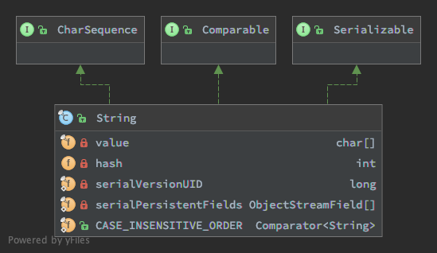

## 概览
出镜率和基本类型一样高的核心数据结构，可以没有 boolean , 但是不能没有 String. 帝国基石。  

## 常见用法
[测试类](../tests/lang/StringTest.java)
```java
int length = "test".length();
assertEquals(4, length);

boolean bc = "test".contains("tes");
assertEquals(true, bc);

boolean bs = "test".startsWith("tes");
assertEquals(true, bs);

boolean be = "test".endsWith("st");
assertEquals(true, be);

char cc = "test".charAt(3);
assertEquals('t', cc);

int ii = "test".indexOf('e');
assertEquals(1, ii);

java.lang.StringTest trim = " test ".trim();
assertEquals("test", trim);

java.lang.StringTest[] es = "test".split("e");
assertEquals(2, es.length);
assertEquals("t", es[0]);
assertEquals("st", es[1]);

java.lang.StringTest substring = "test".substring(1, 2);
assertEquals("e", substring);

java.lang.StringTest uc = "test".toUpperCase();
assertEquals("TEST", uc);

java.lang.StringTest lc = "tEst".toLowerCase();
assertEquals("test", lc);

java.lang.StringTest replace = "test".replace("te", "T");
assertEquals("Tst", replace);

java.lang.StringTest ra = "stest".replaceAll(".{2}t", "T");
assertEquals("stT", ra);

java.lang.StringTest test = java.lang.StringTest.join(",", "x", "y", "z");
assertEquals("x,y,z", test);

java.lang.StringTest j2 = java.lang.StringTest.join(",", Arrays.asList("x", "y", "z"));
assertEquals("x,y,z", j2);

```

## 继承结构

## 主要属性
### 成员变量
```java
/** The value is used for character storage. */
private final char value[]; // 字符数组， 存储字符

/** Cache the hash code for the string */
private int hash; // Default to 0 // 性能优化， String 的实现是不可变的， 生命周期内 hash 也是不会变得， 不用每次计算。 
```
### 静态变量
```java
/** use serialVersionUID from JDK 1.0.2 for interoperability */
private static final long serialVersionUID = -6849794470754667710L;

/**
 * Class String is special cased within the Serialization Stream Protocol.
 *
 * A String instance is written into an ObjectOutputStream according to
 * <a href="{@docRoot}/../platform/serialization/spec/output.html">
 * Object Serialization Specification, Section 6.2, "Stream Elements"</a>
 */
private static final ObjectStreamField[] serialPersistentFields =
    new ObjectStreamField[0]; 与序列化有关， 后续分析序列化时再详细分析
```

## 主要方法

### 构造函数

```java
/**
 * Initializes a newly created {@code String} object so that it represents
 * an empty character sequence.  Note that use of this constructor is
 * unnecessary since Strings are immutable.
 */
public String() {
    this.value = "".value;
}

/**
 * Constructs a new {@code String} by decoding the specified subarray of
 * bytes using the specified {@linkplain java.nio.charset.Charset charset}.
 * The length of the new {@code String} is a function of the charset, and
 * hence may not be equal to the length of the subarray.
 *
 * <p> This method always replaces malformed-input and unmappable-character
 * sequences with this charset's default replacement string.  The {@link
 * java.nio.charset.CharsetDecoder} class should be used when more control
 * over the decoding process is required.
 *
 * @param  bytes
 *         The bytes to be decoded into characters
 *
 * @param  offset
 *         The index of the first byte to decode
 *
 * @param  length
 *         The number of bytes to decode
 *
 * @param  charset
 *         The {@linkplain java.nio.charset.Charset charset} to be used to
 *         decode the {@code bytes}
 *
 * @throws  IndexOutOfBoundsException
 *          If the {@code offset} and {@code length} arguments index
 *          characters outside the bounds of the {@code bytes} array
 *
 * @since  1.6
 */
public String(byte bytes[], int offset, int length, Charset charset) {
    if (charset == null)
        throw new NullPointerException("charset");
    checkBounds(bytes, offset, length);
    this.value =  StringCoding.decode(charset, bytes, offset, length);
}

```

### 实例方法

#### concat 字符串连接
```java
/**
 * Concatenates the specified string to the end of this string.
 * <p>
 * If the length of the argument string is {@code 0}, then this
 * {@code String} object is returned. Otherwise, a
 * {@code String} object is returned that represents a character
 * sequence that is the concatenation of the character sequence
 * represented by this {@code String} object and the character
 * sequence represented by the argument string.<p>
 * Examples:
 * <blockquote><pre>
 * "cares".concat("s") returns "caress"
 * "to".concat("get").concat("her") returns "together"
 * </pre></blockquote>
 *
 * @param   str   the {@code String} that is concatenated to the end
 *                of this {@code String}.
 * @return  a string that represents the concatenation of this object's
 *          characters followed by the string argument's characters.
 */
public String concat(String str) {
    int otherLen = str.length();  // 小心 NullPointException.
    if (otherLen == 0) {
        return this;  // 返回自身
    }
    int len = value.length;
    char buf[] = Arrays.copyOf(value, len + otherLen);  // 复制字符数组
    str.getChars(buf, len); // 从 len 索引位置开始复制字节数组数据
    return new String(buf, true);
}
```
这个方法用的少，一般都是用 "xx" + "yy' 实现了。从实现上来看， 此方法会更高效。

#### startsWith & endsWith 方法
```java
/**
 * Tests if the substring of this string beginning at the
 * specified index starts with the specified prefix.
 *
 * @param   prefix    the prefix.
 * @param   toffset   where to begin looking in this string.
 * @return  {@code true} if the character sequence represented by the
 *          argument is a prefix of the substring of this object starting
 *          at index {@code toffset}; {@code false} otherwise.
 *          The result is {@code false} if {@code toffset} is
 *          negative or greater than the length of this
 *          {@code String} object; otherwise the result is the same
 *          as the result of the expression
 *          <pre>
 *          this.substring(toffset).startsWith(prefix)
 *          </pre>
 */
public boolean startsWith(String prefix, int toffset) {
    char ta[] = value;
    int to = toffset;
    char pa[] = prefix.value;
    int po = 0;
    int pc = prefix.value.length;
    // Note: toffset might be near -1>>>1.
    if ((toffset < 0) || (toffset > value.length - pc)) {  // 可以有个小优化， toffset < 0 判断可以提到方法体最前面。 
        return false;
    }
    while (--pc >= 0) { // 循环比对字符
        if (ta[to++] != pa[po++]) { 
            return false;
        }
    }
    return true;
}

/**
 * Tests if this string ends with the specified suffix.
 *
 * @param   suffix   the suffix.
 * @return  {@code true} if the character sequence represented by the
 *          argument is a suffix of the character sequence represented by
 *          this object; {@code false} otherwise. Note that the
 *          result will be {@code true} if the argument is the
 *          empty string or is equal to this {@code String} object
 *          as determined by the {@link #equals(Object)} method.
 */
public boolean endsWith(String suffix) {
    return startsWith(suffix, value.length - suffix.value.length); // 调用 startsWith 从末尾最近处开始比对。
}
```
这两兄弟出镜率也挺高。实现比较简单。 

#### indexOf 系列
主要包含 indexOf , lastIndexOf 方法。 判断指定字符或字符串在目标字符串的起始位置。

```java
/**
 * Returns the index within this string of the first occurrence of the
 * specified character, starting the search at the specified index.
 * <p>
 * If a character with value {@code ch} occurs in the
 * character sequence represented by this {@code String}
 * object at an index no smaller than {@code fromIndex}, then
 * the index of the first such occurrence is returned. For values
 * of {@code ch} in the range from 0 to 0xFFFF (inclusive),
 * this is the smallest value <i>k</i> such that:
 * <blockquote><pre>
 * (this.charAt(<i>k</i>) == ch) {@code &&} (<i>k</i> &gt;= fromIndex)
 * </pre></blockquote>
 * is true. For other values of {@code ch}, it is the
 * smallest value <i>k</i> such that:
 * <blockquote><pre>
 * (this.codePointAt(<i>k</i>) == ch) {@code &&} (<i>k</i> &gt;= fromIndex)
 * </pre></blockquote>
 * is true. In either case, if no such character occurs in this
 * string at or after position {@code fromIndex}, then
 * {@code -1} is returned.
 *
 * <p>
 * There is no restriction on the value of {@code fromIndex}. If it
 * is negative, it has the same effect as if it were zero: this entire
 * string may be searched. If it is greater than the length of this
 * string, it has the same effect as if it were equal to the length of
 * this string: {@code -1} is returned.
 *
 * <p>All indices are specified in {@code char} values
 * (Unicode code units).
 *
 * @param   ch          a character (Unicode code point).
 * @param   fromIndex   the index to start the search from.
 * @return  the index of the first occurrence of the character in the
 *          character sequence represented by this object that is greater
 *          than or equal to {@code fromIndex}, or {@code -1}
 *          if the character does not occur.
 */
public int indexOf(int ch, int fromIndex) {
    final int max = value.length;
    if (fromIndex < 0) {
        fromIndex = 0;
    } else if (fromIndex >= max) {
        // Note: fromIndex might be near -1>>>1.
        return -1;
    }

    if (ch < Character.MIN_SUPPLEMENTARY_CODE_POINT) { // unicode 最小值
        // handle most cases here (ch is a BMP code point or a
        // negative value (invalid code point))
        final char[] value = this.value;
        for (int i = fromIndex; i < max; i++) {
            if (value[i] == ch) {
                return i;
            }
        }
        return -1;
    } else {
        return indexOfSupplementary(ch, fromIndex);
    }
// 判断字符在字符串的起始位置， 简而言之， 使用 ascii 码性能最好。

}

/**
 * Code shared by String and StringBuffer to do searches. The
 * source is the character array being searched, and the target
 * is the string being searched for.
 *
 * @param   source       the characters being searched.
 * @param   sourceOffset offset of the source string.
 * @param   sourceCount  count of the source string.
 * @param   target       the characters being searched for.
 * @param   targetOffset offset of the target string.
 * @param   targetCount  count of the target string.
 * @param   fromIndex    the index to begin searching from.
 */
static int indexOf(char[] source, int sourceOffset, int sourceCount,
        char[] target, int targetOffset, int targetCount,
        int fromIndex) {
    if (fromIndex >= sourceCount) {
        return (targetCount == 0 ? sourceCount : -1);
    }
    if (fromIndex < 0) {
        fromIndex = 0;
    }
    if (targetCount == 0) {
        return fromIndex;
    }

    char first = target[targetOffset];
    int max = sourceOffset + (sourceCount - targetCount);

    for (int i = sourceOffset + fromIndex; i <= max; i++) {
        /* Look for first character. */
        if (source[i] != first) {
            while (++i <= max && source[i] != first);
        }

        /* Found first character, now look at the rest of v2 */
        if (i <= max) {
            int j = i + 1;
            int end = j + targetCount - 1;
            for (int k = targetOffset + 1; j < end && source[j]
                    == target[k]; j++, k++);

            if (j == end) {
                /* Found whole string. */
                return i - sourceOffset;
            }
        }
    }
    return -1;
}
// 1. 找到首字符的位置
// 2. 从首字符的位置循环比对， 都相等返回首字符的位置


/**
 * Returns true if and only if this string contains the specified
 * sequence of char values.
 *
 * @param s the sequence to search for
 * @return true if this string contains {@code s}, false otherwise
 * @since 1.5
 */
public boolean contains(CharSequence s) {
    return indexOf(s.toString()) > -1;
}
// indexOf 的应用， 判断是否包含指定字符串
```

#### 正则表达式相关
- split
- replace
- replaceAll
分析正则表达式时再补充。

### 静态方法
#### join 方法
1.8 新加的。
```java
/**
 * Returns a new {@code String} composed of copies of the
 * {@code CharSequence elements} joined together with a copy of the
 * specified {@code delimiter}.
 *
 * <blockquote>For example,
 * <pre>{@code
 *     List<String> strings = new LinkedList<>();
 *     strings.add("Java");strings.add("is");
 *     strings.add("cool");
 *     String message = String.join(" ", strings);
 *     //message returned is: "Java is cool"
 *
 *     Set<String> strings = new LinkedHashSet<>();
 *     strings.add("Java"); strings.add("is");
 *     strings.add("very"); strings.add("cool");
 *     String message = String.join("-", strings);
 *     //message returned is: "Java-is-very-cool"
 * }</pre></blockquote>
 *
 * Note that if an individual element is {@code null}, then {@code "null"} is added.
 *
 * @param  delimiter a sequence of characters that is used to separate each
 *         of the {@code elements} in the resulting {@code String}
 * @param  elements an {@code Iterable} that will have its {@code elements}
 *         joined together.
 *
 * @return a new {@code String} that is composed from the {@code elements}
 *         argument
 *
 * @throws NullPointerException If {@code delimiter} or {@code elements}
 *         is {@code null}
 *
 * @see    #join(CharSequence,CharSequence...)
 * @see    java.util.StringJoiner
 * @since 1.8
 */
public static String join(CharSequence delimiter,
        Iterable<? extends CharSequence> elements) {
    Objects.requireNonNull(delimiter);
    Objects.requireNonNull(elements);
    StringJoiner joiner = new StringJoiner(delimiter);
    for (CharSequence cs: elements) {
        joiner.add(cs);
    }
    return joiner.toString();
}
```
目的是把多个字符串以指定分隔符连接起来， 主要依赖的是 StringJoiner。 StringJoiner 的逻辑也很简单，使用 StringBuilder 连接。


## 常见问题
### 平时开发都是直接 ```String x = "xxx"```，没有使用 ```String x = new String("xxx") ``` ， 这两种方式有啥区别，怎么选择？
结论，使用 String x = "xxx"  
通过反编译字节码可以看出两种方式的区别， 示例如下  
```java
public class StringInit {
  public static void main(String[] args) {
    String x = "test";

    String y = new String("test");
  }
}
```
反编译如下  
```bash
 0: ldc           #2                  // String test
 2: astore_1
 3: new           #3                  // class java/lang/String
 6: dup
 7: ldc           #2                  // String test
 9: invokespecial #4                  // Method java/lang/String."<init>":(Ljava/lang/String;)V
12: astore_2
13: return

# ------

# String x = "test" ， 对应两条指令
       0: ldc           #2                  // String test
       2: astore_1
ldc 从常量池加载字符串 test 到操作数栈栈顶
astore_1 把操作数栈栈顶数据存到本地变量表 1 

# String y = new String("test"), 对应 5 条指令，还包含一个方法执行指令。
       3: new           #3                  // class java/lang/String
       6: dup
       7: ldc           #2                  // String test
       9: invokespecial #4                  // Method java/lang/String."<init>":(Ljava/lang/String;)V
      12: astore_2
new 新建 String 实例，置于操作数栈栈顶。
dup 复制操作数栈栈顶数据，并置于操作数栈栈顶
ldc 从常量池加载字符串 test 到操作数栈栈顶
invokespecial 执行构造方法， 对应 String(String x). 会消耗掉操作数栈顶的一个 String 实例。 
astore_2 把操作数栈栈顶数据存到本地变量表 2
```
从上面的反编译字节码可以看出 String x = "xxx" 的效率更高。   

> **画外音:** 总是不可避免的和字节码打交道, 就像写 C 语言不可避免的和 ASM 打交道一样。 

### ```"xxx" + "yyy"``` 是什么魔法？ 如果用过 C 语言，会发现字符串不能直接相加。  
>The Java language provides special support for the string
>concatenation operator (&nbsp;+&nbsp;), and for conversion of
>other objects to strings. String concatenation is implemented
>through the {@code StringBuilder}(or {@code StringBuffer})
>class and its {@code append} method.

还是编译器的魔法，编译期使用 StringBuilder append 构建的。 这是 Java 里唯一的运算符重载。 
源码  
```java
public class StringPlus {
  public static void main(String[] args) {
    String a = "aaa";
    String b = "bbb";
    String c = a + b;
  }
}
```
反编译  
```bash
 0: ldc           #2                  // String aaa
 2: astore_1
 3: ldc           #3                  // String bbb
 5: astore_2
 6: new           #4                  // class java/lang/StringBuilder
 9: dup
10: invokespecial #5                  // Method java/lang/StringBuilder."<init>":()V
13: aload_1
14: invokevirtual #6                  // Method java/lang/StringBuilder.append:(Ljava/lang/String;)Ljava/lang/StringBuilder;
17: aload_2
18: invokevirtual #6                  // Method java/lang/StringBuilder.append:(Ljava/lang/String;)Ljava/lang/StringBuilder;
21: invokevirtual #7                  // Method java/lang/StringBuilder.toString:()Ljava/lang/String;
24: astore_3
25: return

```
反编译的代码等价于如下代码
```java
public class StringPlus {
  public static void main(String[] args) {
    String arg1 = "aaa";
    String arg2 = "bbb";
    String arg3 = new StringBuilder().append(args1).append(args2).toString();
  }
}
```

### String 的不变性，什么是不可变类，不可变类意味着什么，怎么实现不可变类, 为什么要设计为不可变类，

- 不可变类只是其实例不能被修改的类。每个实例中包含的所有信息都必须在创建该实例的时候就提供，并且在对象的整个生命周期内固定不变。  
- 不可变类意味着实例创建后，实例的状态不能被改变。 
- 怎么实现不可变类
  - 不要提供任何会修改对象状态的方法。 String 类方法不会改变自身状态，通常会返回新的字符串
  - 保证类不会被扩展。 String 类声明为 final, 无法被继承
  - 保证属性为 final， 除构造方法外， 无法被修改。 
  - 保证属性为私有， 外部无法直接访问。
- String 为什么要设计为不可变类
  - String 被类似类加载器等虚拟机核心机制依赖
  - String 的定位和基础类型的包装类一致, 不可变符合直觉
  - 不可变无副作用，集合业务，并发业务可无负担使用。

###  关于 String intern 方法。  
建议不用深究， 意义不大，在几个主流代码库（spring, netty, dubbo) 搜索均没有该方法的使用。  

### [Switch](https://docs.oracle.com/javase/specs/jls/se8/html/jls-14.html#jls-14.11) 语句与 String  
> The type of the Expression must be char, byte, short, int, Character, Byte, Short, Integer, String, or an enum type (§8.9), or a compile-time error occurs.

JDK 1.7 的新特性，编译器做的手脚，可以通过反编译一探究竟
```java
public class StringSwitch {
  public static void main(String[] args) {
    String test = "test";
    int result = 0;
    switch (test){
     case "test":
        result = 1;
        break;
     case "test2":
        result = 2;
        break;
      default:
        break;
    }
  }
}
```
反编译代码如下  
```bash
  0: ldc           #2                  // String test
  2: astore_1
  3: iconst_0
  4: istore_2
  5: aload_1
  6: astore_3
  7: iconst_m1
  8: istore        4
 10: aload_3
 11: invokevirtual #3                  // Method java/lang/String.hashCode:()I
 14: lookupswitch  { // 2
       3556498: 40
     110251488: 55
       default: 67
    }
 40: aload_3
 41: ldc           #2                  // String test
 43: invokevirtual #4                  // Method java/lang/String.equals:(Ljava/lang/Object;)Z
 46: ifeq          67
 49: iconst_0
 50: istore        4
 52: goto          67
 55: aload_3
 56: ldc           #5                  // String test2
 58: invokevirtual #4                  // Method java/lang/String.equals:(Ljava/lang/Object;)Z
 61: ifeq          67
 64: iconst_1
 65: istore        4
 67: iload         4
 69: lookupswitch  { // 2
             0: 96
             1: 101
       default: 106
   }
 96: iconst_1
 97: istore_2
 98: goto          106
101: iconst_2
102: istore_2
103: goto          106
106: return
```
可以看到最终转化成 lookupswitch 指令。  
3556498 是字符串 "test" 的 hashCode  
110251488 是字符串 "test2" 的 hashCode  

最终还是使用了 int 来实现 switch 的。 处理方式跟对 enum 类型支持是一样的。 

## 补充
### String 的不变性可以通过反射绕过。 
```java
  // 改变字符串
  private static void test_reflection() {
    String test = "test";
    try {
      Field filed = String.class.getDeclaredField("value");
      filed.setAccessible(true);
      char[] val = (char[]) filed.get(test);
      val[0] = 'T';
      assertEquals("Test", test);
    } catch (NoSuchFieldException | IllegalAccessException e) {
      e.printStackTrace();
    }
  }
```

## 后记
1. 暂不分析 native 方法实现
2. 一家之言， 难免疏忽

## 参考
- [JDK 之 String 源码阅读笔记](https://emacsist.github.io/2017/07/01/jdk-%E4%B9%8B-string-%E6%BA%90%E7%A0%81%E9%98%85%E8%AF%BB%E7%AC%94%E8%AE%B0/)
- [String源码分析](https://juejin.im/post/59fffddc5188253d6816f9c1)
- [深入解析String#intern](https://tech.meituan.com/2014/03/06/in-depth-understanding-string-intern.html)
- [String 为什么不可变 ?](https://juejin.im/post/59cef72b518825276f49fe40)
