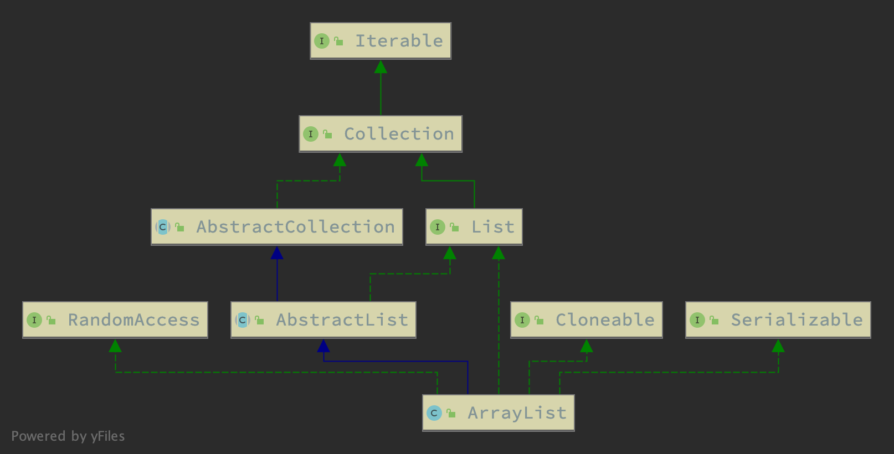

## 概览
算是平常业务代码中使用最多的数据结构了, 和 HashMap 一时双璧.  
ArrayList, 分为两部分, Array 数组. List 列表. 它首先是个列表. Array 表明列表的实现方式.  

## 常用操作
```java

ArrayList<String> list = new ArrayList<>(10); // 初始化列表
list.add("s0"); // 添加元素
list.add(0, "s0"); // 像指定位置添加元素
list.size();   // 列表长度

list.get(0); // 获取元素内容

```

## 继承结构


继承自 AbstractList.
实现了 Serialziable 接口 => 可序列化
实现了 Cloneable 接口 => 可克隆
实现了 RandomAccess 接口 => 可以使用指定 index 的方式在 O(1) 时间复杂度下访问内部数据

## 主要属性
### 成员变量
```java
/**
 * The array buffer into which the elements of the ArrayList are stored.
 * The capacity of the ArrayList is the length of this array buffer. Any
 * empty ArrayList with elementData == DEFAULTCAPACITY_EMPTY_ELEMENTDATA
 * will be expanded to DEFAULT_CAPACITY when the first element is added.
 */
transient Object[] elementData; // non-private to simplify nested class access

/**
 * The size of the ArrayList (the number of elements it contains).
 *
 * @serial
 */
private int size;
```

### 静态变量
```java
/**
 * Default initial capacity.
 */
private static final int DEFAULT_CAPACITY = 10;

/**
 * Shared empty array instance used for empty instances.
 */
private static final Object[] EMPTY_ELEMENTDATA = {};

/**
 * Shared empty array instance used for default sized empty instances. We
 * distinguish this from EMPTY_ELEMENTDATA to know how much to inflate when
 * first element is added.
 */
private static final Object[] DEFAULTCAPACITY_EMPTY_ELEMENTDATA = {};

/**
 * The maximum size of array to allocate.
 * Some VMs reserve some header words in an array.
 * Attempts to allocate larger arrays may result in
 * OutOfMemoryError: Requested array size exceeds VM limit
 */
private static final int MAX_ARRAY_SIZE = Integer.MAX_VALUE - 8;

```

## 内部类

## 主要方法
### 构造函数

### 实例方法

### 静态方法

## 常见问题
1. toArray() vs toArray(xx[] arr)

## 补充
### foreach 的魔法.


## 后记

## 参考
- [为什么默认访问权限可以简化嵌套类访问过程](https://twodam.net/why-non-private-can-simlify-nested-class-access)
- [ArrayList源码解析，老哥，来一起复习一哈？](https://blog.csdn.net/ls_kindling/article/details/105243583)
